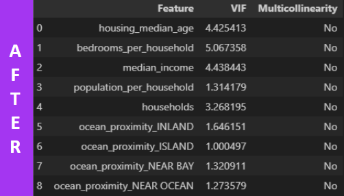

# California Dreamin' or Nightmarin'? Revealing the Hidden Factors Behind 1990's Housing Market
## Capstone Project #3 | Inggar Gumintang | JCDSOL - 014 - 2
Refer to the full version of the code and analysis in the file [ipynb-capstone-tiga](https://github.com/inggargumintang/capstone-tiga-inggar/blob/main/capstone_tiga_inggar.ipynb)

Video: 

`Context:`
In 1990, studying housing prices in California became a prominent topic due to the U.S. economic recession during that period. The recession impacted consumption and personal income, leading to significant effects on the real estate market. The purpose of this study is to identify the factors influencing housing prices in California's blocks in 1990, focusing on the properties of the houses, the income levels of buyers, and the geographical surroundings [[1]](https://eudl.eu/pdf/10.4108/eai.18-11-2022.2327138).

The research employs the housing price impact theory and multiple linear regression to analyze these influencing factors. During this time, while national home prices rose by 0.8%, the growth in California was notably slower, marking the slowest national growth since 1990. This study provides insights into the unique economic and geographic factors that shaped the housing market in California during this recessionary period [[2]](https://www.ppic.org/wp-content/uploads/content/pubs/jtf/JTF_HousingMarketJTF.pdf).

`Problem Statement:`
The 1990 recession slowed California's housing market, with price growth lagging behind the national average. This study identifies factors influencing housing prices in California, focusing on property attributes, buyer income, and location. Using multiple linear regression, we analyze the key determinants of housing price variations in 1990.

`Goal:`
The aim of this study is to create a predictive model for housing prices in California in 1990.

`What We Need?:`
We need to analyze the dataset to uncover patterns and relationships between property characteristics, median income, and geographic factors affecting housing prices. The next step is to build a regression model to predict housing prices, helping users understand these influencing factors and make informed pricing decisions.

## Description of the Dataset

## Data Understanding and Preparation
### Data Cleaning
- Check Data Types
- Check Duplicate
- Handling Missing Value
- Handling Outliers

### Exploratory Data Analysis
#### Correlation

- Income and House Value: The correlation of 0.68 between median income and median house value suggests a strong relationship. Generally, customers seek homes within their budget, and higher income typically enables higher spending on more expensive properties.
- Household Size and Property Features: High correlations between households, population, total bedrooms, and total rooms indicate that larger households and populations are associated with more spacious homes. This trend suggests that customers with larger families or more significant household sizes might prefer properties with more rooms and amenities.

### Data Manipulation
Since our dataset values are aggregated by block (with multiple houses per block), we need to calculate room count, bedroom count, and population per house.

### Data Preprocessing
#### Feature Selection
The VIF analysis indicates that there are no significant multicollinearity issues among the features, allowing for the continued development of the model.
|                 Before Evaluation      |                    After Evaluation        |
| :------------------------------------: | :----------------------------------------: |
|          |                |

#### Modelling & Hyperparameter Tuning
- Based on the evaluation results, Gradient Boosting is the best model with the lowest RMSE and MAPE, as well as the highest R2, indicating superior accuracy and explanatory power compared to Stacking - Linear Regression, which performs worse across all metrics. Other models like Random Forest and XGBoost also perform better than Stacking - Linear Regression, but still fall short compared to Gradient Boosting.
- The hyperparameter tuning for Gradient Boosting did not lead to significant improvements in test metrics. The test RMSE, MAPE, and R² values remained the same before and after tuning, indicating that the selected hyperparameters were already well-suited for this model or that further tuning may be needed to observe more notable changes.

### Conclusion
- Profit Margin Estimation: only increase 0.61% after applied Gradient Boosting, still under 0.8% (read context)
#### Business Recommendations
- Feature Expansion: Improve the dataset with detailed property features and lot size to enhance model accuracy and understanding of pricing factors.
- Target Market Analysis: Focus on high-value properties in desirable locations like "Near Ocean" or "Island" for long-term investments. Tailor offerings to affluent buyers or those interested in vacation properties.
- Price Segmentation: Use insights to better segment the market. Develop marketing strategies that highlight key property attributes in different price categories.
